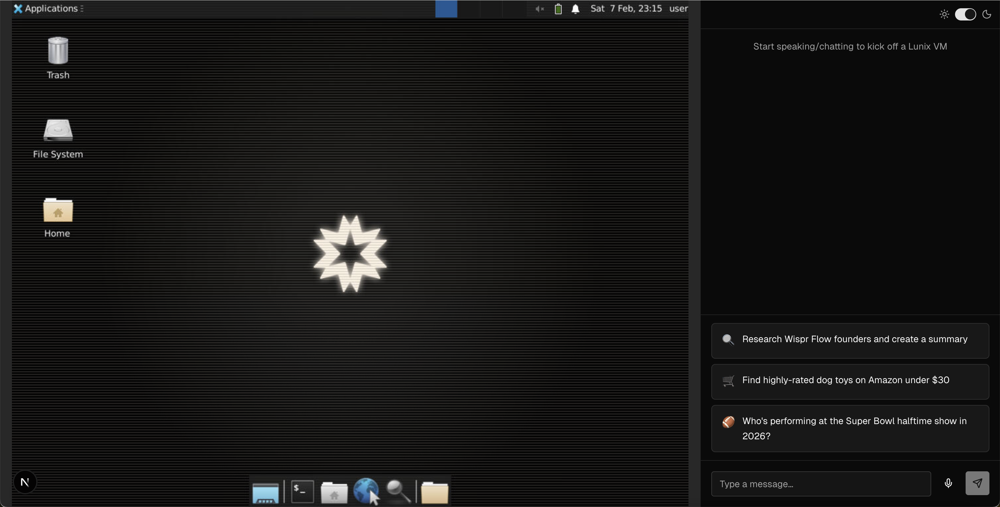
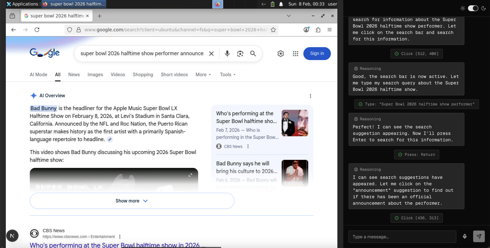
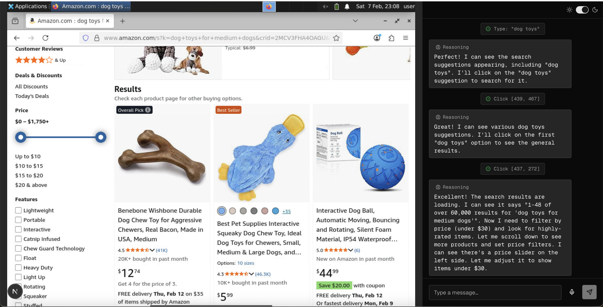

# Autonomous Agent for Remote Desktop Control

An autonomous AI agent with multi-modal capabilities (vision + voice + chat) that controls a remote Linux desktop environment through natural language. Built with Claude's Computer Use API, Deepgram live transcription, and E2B Desktop Sandbox.

## Features

- 🤖 **Fully autonomous agentic loops** - Agent perceives, reasons, acts, and adapts based on visual feedback
- 🎤 **Multi-modal input** - Voice (via Deepgram) and text chat interfaces
- 👁️ **Vision-powered control** - Agent analyzes screenshots to plan and execute actions
- 🖱️ **Computer use tools** - Mouse clicks, keyboard input, bash commands, file editing
- 🖥️ **Real-time desktop streaming** - Live Linux desktop (Xfce) streamed to browser via VNC
- 🔄 **Persistent sessions** - Reconnect to existing sandbox sessions
- 📋 **Clipboard integration** - Read/write clipboard access
- ⚡ **Streaming responses** - Real-time agent reasoning and action updates

## Architecture

The application implements a complete autonomous agent system with perception-action loops:

```
┌─────────────────────────────────────────────────────────────────────┐
│                          User Input Layer                           │
│  Voice Input ──► Deepgram ──► WebSocket ──► Live Transcription      │
│  Text Input  ──────────────────────────────► Chat Interface         │
└───────────────────────────────┬─────────────────────────────────────┘
                                │
                                ▼
┌─────────────────────────────────────────────────────────────────────┐
│                      Agent Orchestration Layer                      │
│  Next.js API Routes + Server-Sent Events (SSE) Streaming            │
└───────────────────────────────┬─────────────────────────────────────┘
                                │
                                ▼
┌─────────────────────────────────────────────────────────────────────┐
│                       Agentic Loop (Claude)                         │
│                                                                     │
│  1. Perception:   Take screenshot of desktop                        │
│  2. Reasoning:    Analyze visual state + user intent                │
│  3. Planning:     Decide which tool(s) to use                       │
│  4. Action:       Execute computer/bash/editor tools                │
│  5. Feedback:     Capture new screenshot                            │
│  6. Iterate:      Loop until task complete                          │
│                                                                     │
│  Tools: computer_use (mouse/keyboard), bash, text_editor            │
└───────────────────────────────┬─────────────────────────────────────┘
                                │
                                ▼
┌─────────────────────────────────────────────────────────────────────┐
│                    Desktop Execution Layer                          │
│  E2B Desktop Sandbox - Isolated Linux VM with VNC streaming         │
│  • Resolution scaling for Claude's vision API                       │
│  • Action executor (clicks, typing, scrolling, bash)                │
│  • Screenshot capture and base64 encoding                           │
└─────────────────────────────────────────────────────────────────────┘
```

### Key Components

- **Voice Pipeline**: Browser MediaRecorder → WebSocket → Deepgram Live API → Real-time transcript
- **Agent Provider**: Claude Agent with Computer Use API (beta 2025-01-24)
- **Action Executor**: Translates agent decisions into desktop interactions
- **Resolution Scaler**: Adapts between display resolution and Claude's vision constraints
- **Streaming Protocol**: SSE for real-time agent reasoning, actions, and status updates

## How the Agent Works

The agent operates in a continuous perception-action loop:

1. **User sends command** (voice or text) - Natural language instruction
2. **Agent initializes sandbox** - Spins up isolated Linux VM if needed
3. **Agentic loop begins**:
    - Agent takes screenshot of desktop
    - Claude analyzes visual state and user intent
    - Plans which computer use tools to invoke
    - Executes actions (mouse clicks, typing, bash commands)
    - Takes new screenshot to verify results
    - Reasons about next steps
4. **Loop continues** until task is complete or user intervenes
5. **Desktop streams live** - User watches agent work in real-time via VNC iframe

## Screenshots

### Home Page



### 🏈 Who's performing at the Super Bowl halftime show in 2026?



### 🛒 Find highly-rated dog toys on Amazon under $30



## Technical Stack

- **Frontend**: Next.js
- **Agent**: Claude Agent with Computer Use tools
- **Voice**: Deepgram live transcription
- **Sandbox**: E2B Desktop Sandbox (isolated Linux VM with VNC)
- **Streaming**: WebSocket (voice), Server-Sent Events (agent responses)
- **Tools**: Computer use, Bash execution, Text editor

## Prerequisites

- Node.js 20+
- E2B API key ([get one here](https://e2b.dev))
- Anthropic API key ([get one here](https://console.anthropic.com))
- Deepgram API key ([get one here](https://deepgram.com))

## Setup

1. **Clone and install dependencies**

```bash
bun install
```

2. **Configure environment variables**

Create `.env.local` from `env.example`:

```bash
cp env.example .env.local
```

Add your API keys:

```
E2B_API_KEY=your_e2b_key_here
ANTHROPIC_API_KEY=your_anthropic_key_here
DEEPGRAM_API_KEY=your_deepgram_key_here
```

3. **Run the development server**

```bash
bun dev
```

Open [http://localhost:3000](http://localhost:3000) and start chatting or speaking to control the desktop.

## Learn More

- [E2B Desktop Documentation](https://e2b.dev/docs/template/examples/desktop)
- [Anthropic Computer Use](https://docs.anthropic.com/en/docs/agents/computer-use)
- [Deepgram Live Transcription](https://developers.deepgram.com/docs/streaming-live-transcription)
- [Next.js Documentation](https://nextjs.org/docs)
